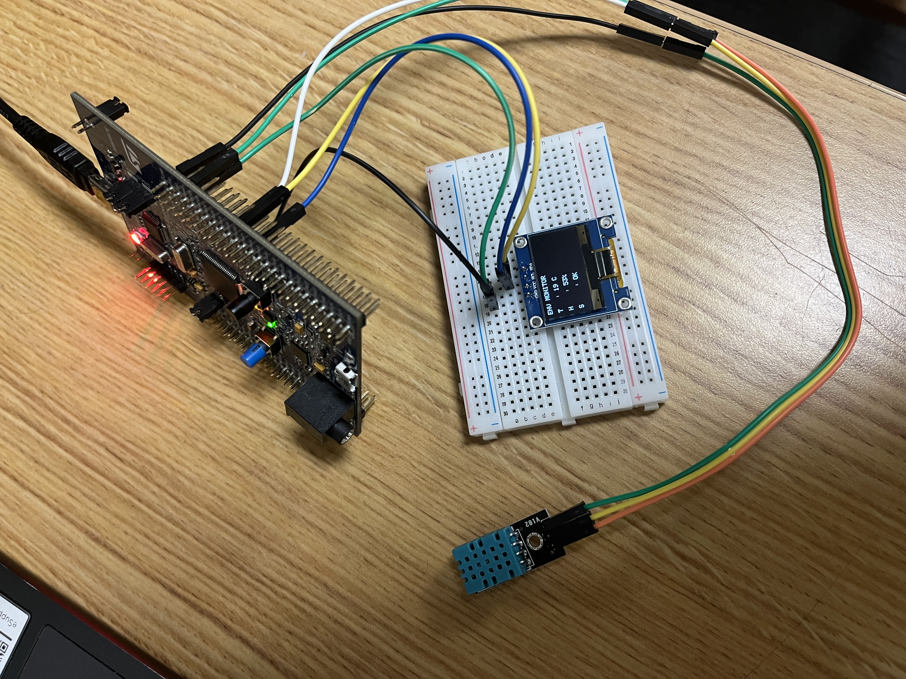
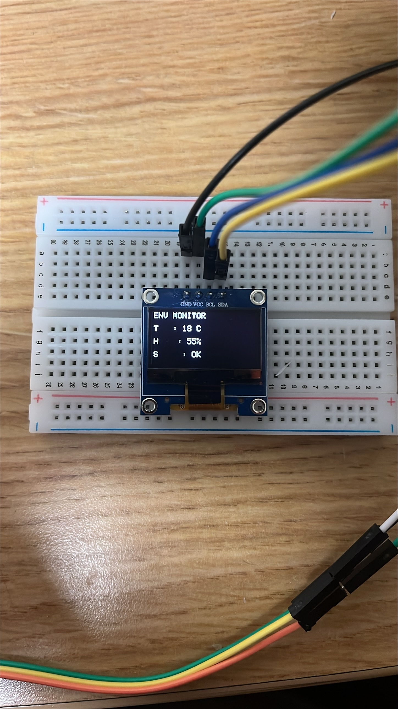

# STM32 FreeRTOS Environmental Monitor

A real-time environmental monitoring system built on the STM32F407 Discovery board using FreeRTOS. Monitors temperature and humidity using a DHT11 sensor and displays real-time data on an SSD1306 OLED display.



## Features

- **Real-time sensor monitoring** - DHT11 temperature and humidity sensor
- **OLED display** - Live data visualization on 128x64 I2C display
- **Multi-tasking architecture** - 3 FreeRTOS tasks running concurrently
- **Inter-task communication** - Queue-based data passing between tasks
- **Resource protection** - Mutex-protected display access
- **Visual indicators** - LED status feedback for system health

## Hardware

- **MCU:** STM32F407VGT6 (ARM Cortex-M4, 168MHz)
- **Development Board:** STM32F407G-DISC1
- **Sensor:** DHT11 Temperature & Humidity Sensor
- **Display:** SSD1306 0.96" OLED (128x64, I2C)
- **LEDs:** Onboard LEDs for status indication

## System Architecture

### Task Structure
```
┌─────────────────┐
│  Default Task   │  Priority: Normal
│  (Heartbeat)    │  Rate: 500ms
└─────────────────┘

┌─────────────────┐
│  Sensor Task    │  Priority: Normal
│  (DHT11 Read)   │  Rate: 2000ms
└────────┬────────┘
         │ Queue
         ▼
┌─────────────────┐
│  Display Task   │  Priority: Normal
│  (OLED Update)  │  Rate: Event-driven
└─────────────────┘
```

### Communication Flow

1. **Sensor Task** reads DHT11 every 2 seconds
2. Data is sent via **FreeRTOS Queue** to Display Task
3. **Display Task** receives data and updates OLED
4. **Mutex** protects shared display resource
5. **LEDs** provide visual feedback

## Pinout

| Component | Pin | Function |
|-----------|-----|----------|
| DHT11 VCC | 3.3V | Power |
| DHT11 GND | GND | Ground |
| DHT11 DATA | PE0 | Data line |
| OLED VCC | 3.3V | Power |
| OLED GND | GND | Ground |
| OLED SCL | PB6 | I2C Clock |
| OLED SDA | PB9 | I2C Data |

## LED Status Indicators

- **Green (LD4):** System heartbeat (500ms blink)
- **Orange (LD3):** Sensor status (solid = good, blink = error)
- **Red (LD5):** Temperature alert (blinks when temp > 25°C)

## Software Architecture

### FreeRTOS Components Used

- **Tasks:** Multi-threaded task execution
- **Queues:** Inter-task data communication
- **Mutexes:** Resource synchronization
- **Delays:** Non-blocking task scheduling

### Key Technologies

- **FreeRTOS** - Real-time operating system
- **I2C** - OLED display communication
- **GPIO** - Sensor data reading and LED control
- **HAL Drivers** - STM32 Hardware Abstraction Layer

## Display Output
```
ENV MONITOR

Temp: 23 C

Humid: 45%

Status: OK
```



## Building and Flashing

### Prerequisites

- STM32CubeIDE (version 1.x or later)
- ST-Link drivers
- STM32F407 Discovery board

### Steps

1. Clone this repository
```bash
   git clone https://github.com/alex-lisi/stm32-freertos-environmental-monitor.git
```

2. Open project in STM32CubeIDE
   - File → Open Projects from File System
   - Select the project directory

3. Build the project
   - Project → Build All (Ctrl+B)

4. Connect STM32F407 board via USB

5. Flash to board
   - Run → Debug (F11) or Run → Run

## Code Structure
```
Core/
├── Src/
│   ├── main.c              # Main application and task definitions
│   ├── freertos.c          # FreeRTOS configuration
│   └── ssd1306.c           # OLED driver implementation
├── Inc/
│   ├── main.h              # Main header file
│   ├── FreeRTOSConfig.h    # RTOS configuration
│   └── ssd1306.h           # OLED driver header
```

## Future Enhancements

- [ ] Add SD card data logging
- [ ] Implement min/max temperature tracking
- [ ] Add user button for display mode switching
- [ ] Power management and sleep modes
- [ ] Add more sensor types (BME280, light sensor)
- [ ] Implement moving average filter for sensor readings

## Lessons Learned

This project demonstrates:
- FreeRTOS task creation and management
- Inter-task communication using queues
- Resource protection using mutexes
- I2C peripheral configuration and communication
- Real-time sensor interfacing
- Professional embedded software architecture

## License

MIT License - feel free to use this project for learning or as a starting point for your own projects.

## Author

Alex Lisi  
[LinkedIn](https://www.linkedin.com/in/alex-lisi)  
[GitHub](https://github.com/alex-lisi)

---

**Built as part of my embedded systems learning journey - October 2025**
